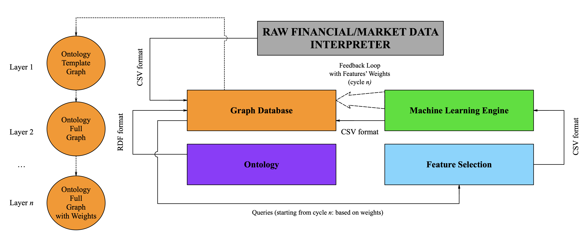

# Predictive Computational Model (PCM)
The aim of the research to create a Generic Predictive Computational Model (PCM) capable of automating analytical conclusions regarding the particular type of data, where information is presented reliably and objectively. This will significantly help to advance data analysis strategy by increasing the level of its consistency, reliability, and efficiency. A holistic approach will be applied, intended at achieving systematic, functional, technical, methodological and informational compatibility of the components of the analysis into a single whole.

The proposed system’s main feature is the consolidation of information management with the decision-making process to serve the prediction purpose. This involves the management of a vast amount of heterogeneous data based on semantic methods and graph-based methods (ontology, knowledge graphs, graph database) as well as advanced machine learning methods.

The main focus of our research is advanced data pre-processing aimed at the more efficient feature selection.

The project presents two use cases: the UK companies’ bankruptcy level detection (1) and FTSE100 index prediction (2).

__The pipeline:__ Raw Financial Data is fed to the Graph Database which is additionally structured by the Financial Ontology and updated by the feedback loop from the Machine Learning Engine. The latter is used to update the weights of the nodes/relationships in the Graph DB. The Graph DB queries output Features that serve the basis for the machine learning-based prediction. The output of the latter is fed back to the Graph DB to update the weights.

## Files List – Use Case 1 – Companys' Bunkruptcy Prediction (BPCM model)

* weights importance uc1.csv – CSV file with Random Forest Feature Importance Prediction Results.
* BPCM NN v.2.0.py – Python Code of BPCM Neural Network.
* Company A Fin Indicators.csv – CSV file with Company A data taken from FAME database.
* Company A Fin Ratios.csv – CSV file with Company A data taken from FAME database.
* cypher queries uc1.py – Python Code of Feature Selection in Neo4j.
* feature importance uc1.py – Python Code of Random Forest Feature Importance Prediction.
* import to neo4j uc1.py – Python Code: Importing the OBP Ontology to Neo4j and Filling the Graph Database with data.
* Input Data with Neo4j Feature Selection.csv – CSV File with Selected Data imported from Neo4j.
* NN with neo4j feature selection.py – Python Code of BPCM Neural Network with Feature Selection.
* OBP Ontology v.2.1.owl – OBP Ontology RDF file (saved as OWL).
* Ratios Export.csv – CSV File with Input Data imported from Neo4j.
* Training Data 2019 43.csv – CSV File with Training Data for BPCM Neural Network.
* training data file after neo4j fs.py – Python Code for Training Data file after Feature Selection generation.
* Training Data with Neo4j Feature Selection.csv – CSV File with Training Data after Feature Selection for BPCM Neural Network.
* Training Output 2019 43.csv – CSV File with Training Output Data for BPCM Neural Network.

## Files List – Use Case 2 - Price Index Prediction (PIPCM model)

* weights importance uc2.csv – CSV file with Random Forest Feature Importance Prediction Results.
* combined output.csv – CSV file with combined output of LSTMs generated in main.py. 
* cypher queries uc2.py – Python Code of Feature Selection in Neo4j.
* feature importance uc2.py – Python Code of Random Forest Feature Importance Prediction.
* feature selection from neo4j.csv – CSV File with Input Data after Feature Selection imported from Neo4j.
* fill ontology in neo4j uc2.py – Python Code: Filling the Neo4j database with Data.
* final results feature selection neo4j.csv – CSV file with Linear Regression final results with Feature
Selection.
* final results.csv – CSV file with Linear Regression final results (without Feature Selection).
* import to neo4j uc2.py – Python Code: Importing the OPIP Ontology to Neo4j.
* Input Data from Neo4j.csv – CSV File with Data imported from Neo4j.
* input data import from neo4j.py – Python Code: Importing Input Data from Neo4j.
* linear regression feature selection neo4j.py – Python Code of PIPCM Linear Regression with Feature Selection.
* linear regression.py - Python Code of PIPCM Linear Redresion (without Feature Selection).
* main_lstms_concatenation_unit.py – Python Code: Concatenation Unit.
* Price Index Prediction v3.2.owl – OPIP Ontology RDF file (saved as OWL).
* Processed Input Data FTSE100 1985 21.csv – CSV file with Input Date taken from external sources. 
* lstm AWE.py, ..., lstm UR.py – Python Code with single LSTMs.
